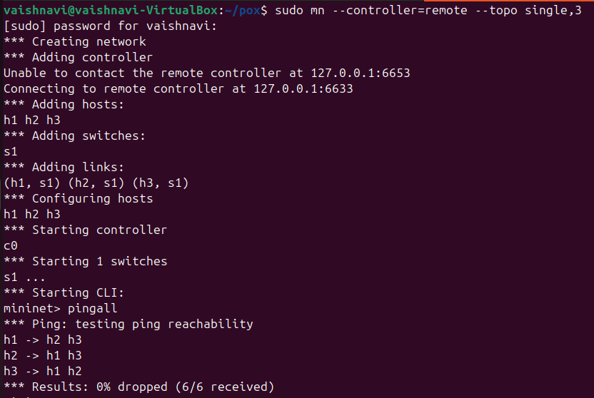
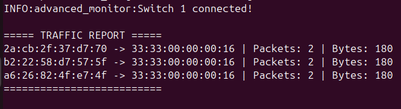
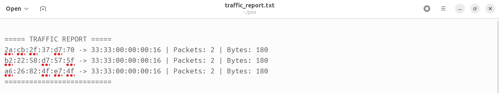

# SDN Traffic Monitoring and Statistics Collector

## 📌 Problem Statement

This project implements a Software Defined Networking (SDN) controller that monitors network traffic using Mininet and POX. The controller collects and displays flow statistics such as packet count and byte count.

---

## 🎯 Objectives

* Implement an SDN controller using POX
* Monitor network traffic in real-time
* Retrieve flow statistics from switches
* Display packet and byte counts
* Generate simple traffic reports

---

## 🛠️ Tools Used

* Mininet (Network Emulator)
* POX Controller
* Python

---

## ⚙️ Setup Instructions

### 1. Install Mininet

```bash
sudo apt update
sudo apt install mininet -y
```

### 2. Clone POX Controller

```bash
git clone https://github.com/noxrepo/pox
cd pox
```

### 3. Place Controller File

Copy `advanced_monitor.py` into the POX directory.

---

## 🚀 Running the Project

### Step 1: Start Controller

```bash
cd ~/pox
./pox.py advanced_monitor
```

### Step 2: Start Mininet (new terminal)

```bash
sudo mn --controller=remote --topo single,3
```

### Step 3: Test Network

Inside Mininet:

```bash
pingall
```

---

## 📊 Output

The controller generates:

* Flow statistics
* Packet count
* Byte count
* Traffic reports

### Example Output

```
===== TRAFFIC REPORT =====
00:00:00:00:00:01 -> 00:00:00:00:00:02 | Packets: 10 | Bytes: 840
==========================
```

---

## 📁 Report Generation

* Traffic statistics are stored in a file:
  `traffic_report.txt`

* The file is:

  * Cleared at the start of each run
  * Updated periodically during execution

* This ensures fresh results for every execution.

---

## 🔍 Features

* Dynamic flow rule installation
* MAC address learning (Learning Switch)
* Periodic statistics collection
* Real-time traffic monitoring
* File-based report generation

---

## 🔒 Note

Runtime-generated files such as `traffic_report.txt` are excluded from the repository using `.gitignore`.

---

## 📷 Proof of Execution

### 🔹 Mininet Connectivity Test



---

### 🔹 Controller Traffic Monitoring



---

### 🔹 Generated Traffic Report File



---

## ✅ Conclusion

This project successfully demonstrates SDN-based traffic monitoring using a POX controller that dynamically collects, analyzes, and reports network statistics.
